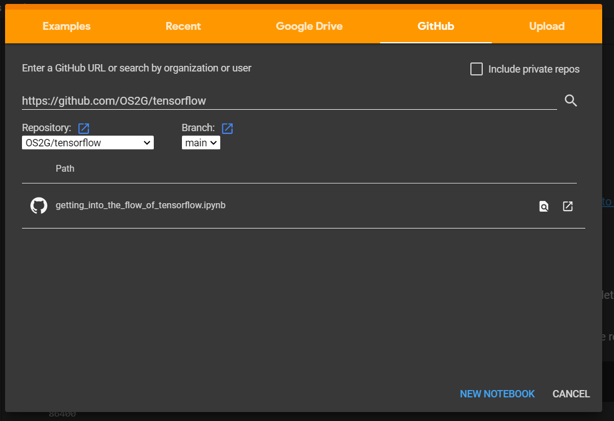

# Tensorflow
Description: The basics of machine learning with tensorflow and basics of its usage.

- [Loading Jupyter Notebooks in Colab](#loading-jupyter-notebooks-in-colab)

## Loading Jupyter Notebooks in Colab

For the sake of simplicity, we will be loading the colab notebooks for today's talk from this Github repo, but this can be done in several different ways.

## Tensorflow Hello World: MNIST
Please open the notebook titled "Getting into the flow of tensorflow" from the Github repo. 

## Where to go next
Now that we've shown how simple it is to run a basic ML task using tensorflow, let's take a look at where you can go next to learn more.

### Further Examples
Many people have published a wide range of .ipynb notebooks that do just about anything you can image. Google in particular has a slew of worthwhile tutorials that demonstrate different functionalities of tensorflow that can be found at https://www.tensorflow.org/guide/ .

#### Tensorboard
Understanding the structure and performance of a network can be challenging. Tensorboard is an incredibly useful tool which makes it simple to visually see both the structure of a network and how it performs over time. This tutorial explains the basics and showcases its utility in visualising results: https://www.tensorflow.org/tensorboard/get_started. 

#### GPU vs CPU
Another valuable feature of tensorflow is its GPU support. Tensorflow is extensively optimized to run on hardware.
## Debugging

### Tensorflow API Documentation

### TF Version Compatibility

### Communities

